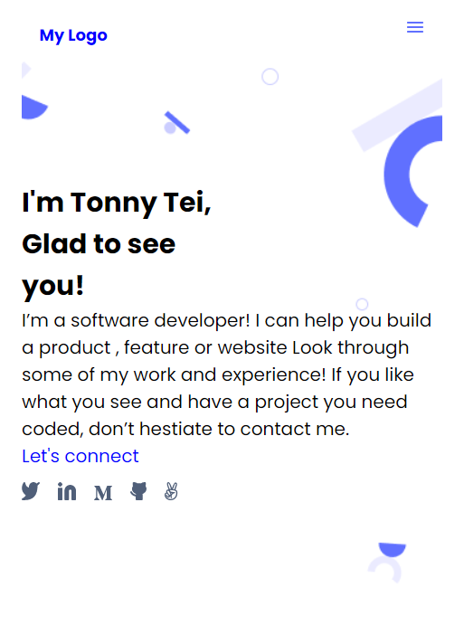

# My portfolio project
## Description
This is the first page of my mobile setup porfolio project. It contains my name and a brief description of me.

## What its built with
1. HTML
2. CSS3

### Screenshot

# Getting started
To get a local copy up and running, do the following steps:

## Prerequisites
1. A text editor
2. Git and github setup.

## Set it up
On your terminal, navigate to your current directory and run this code:
git clone git@github.com:teitonny/final-portfolio.git

Then run: 
cd final-portfolio

Open the project in your favourite code editor. 
You can use "code ." for VS Code.

On your terminal, 

## Author
 ~ Name: Tonny Tei
 ~ Twitter: https://twitter.com/@TonnyTei 

 ### Contributing
Contributions, issues, and features requests are welcome. 
Feel free to send me an email @ tonnytei4@gmail.com

  ## Show your support
Give a star if you like my work

## Acknowledgement
Thanks to microverse for teaching me how to write codes.

## Linces
This project is MIT licensed.
